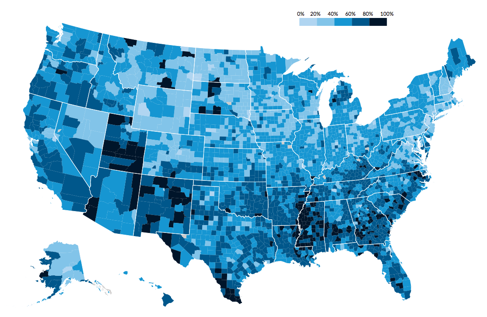

#Urban Institute reusable map template - WIP
d3 template for county and state level maps using Urban's style
* Primary goal: make standard maps with as little work as possible for the blog, website, etc
* Nice side effect: coerce good mapmaking decisions by having good defaults and style. [% > count](https://xkcd.com/1138/).

* Responsive using [pym.js](https://github.com/nprapps/pym.js)
* Use Urban's [datatools embed](https://github.com/UrbanInstitute/datatools-embed) for wrapper

##Usage
###All defaults

Full body from [map1.html](/map1.html)
```html
<body>

    <h2>All defaults</h2>
    <div id="legend"></div>
    <div id="map">
    </div>
    <div class="footnote">
        <p><b>Source</b>: Urban Institute, 2015</p>
        <div class="links">
            <a href="http://www.urban.org" target="_blank">Embed map</a>
            <a href="img/fallback1.png" target="_blank">Save map as image</a>
            <a href="http://www.urban.org" target="_blank" class="urban"><span style="color:#1696d2">Urban</span> <span style="color:#000">Institute</span></a>
        </div>
    </div>

    <script src="lib/jquery.js"></script>
    <script src="lib/d3.v3.min.js"></script>
    <script src="lib/modernizr.svg.min.js"></script>
    <script src="lib/topojson.v1.min.js"></script>
    <script src="lib/pym.min.js"></script>
    <script src="js/colorpalettes.js"></script>
    <script src="js/responsive-map.js"></script>

    <script>
        data_url = "data/schoolpoverty.csv",
            valuetomap = "PercentPoor_NCES",
            countyid = "fipscounty";

        var pymChild = new pym.Child();
    </script>

</body>
```
###Customs

Script from [map3.html](/map3.html)
```javascript
    data_url = "data/schoolpoverty.csv",
        valuetomap = "TotalBlack",
        countyid = "fipscounty",
        colors = ["#feebe2","#fbb4b9","#f768a1","#ae017e"],
        missingcolor = "#000",
        breaks = [200,1000,20000],
        legend_breaks = [200,1000,20000,125000],
        formatter = d3.format('.2s');

    var pymChild = new pym.Child();
```

###Things for the user to define
* Necessary:
 * data_url
 * valuetomap from dataset
 * countyid from dataset
* Can go with the defaults or overwrite:
 * nullcondition - could be *, a value, etc (default: "")
 * colors - predefined palettes or enter an array (default: palette.blue5)
 * missingcolor (default: #ccc)
 * Breaks for bins/legend: (default: 0-100% by 20%)
    * Default: breaks = [0.2, 0.4, 0.6, 0.8], legend_breaks = [0.2, 0.4, 0.6, 0.8, 1.0], legend_left = 0
 * breaks - array excluding min and max
 * legend_breaks - array excluding min
 * legend_left - min to appear in legend
 * formatter (default: d3.format("%"))
 * tooltip text (default: County | XX% )
 * N/A text (default: County | No data)
* For page:
 * title
 * links (optional)

###Features to add
* Roll over legend to highlight bin in map
* A feature that would be good to have is a "redacted" or "ignored flag" --> basically a way of saying "if Column X in the csv meets some condition, add a class to the path and grey it out, plus allow for a custom tooltip"


###To do
* Tooltips:
 * Move to be where the pointer points (top left of pointer)
 * Make a function for user to enter tooltip text
* datatools wrapper it
* Color palettes - add more, update
* 2.0: allow single state mapping: separate jsons & aspect ratios needed for each state
